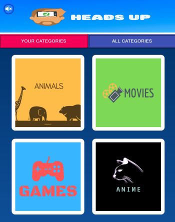

# Heads Up App
> Heads Up is a web game application where players guess words or phrases that appear on the
 mobile held to their foreheads by watching the other players act it out or give hints as time counted down. 
 The aim is to get as many words/phrases correct.




Unfortunately game only works on mobile devices with motion sensors (accelerometer and gyroscope).


You choose a category and one person holds the phone/tablet in front of his/her head.
On the screen a text will appear. The other players have to describe the question to the active player, without mentioning any word from the actual question.
Once the question is guessed the active player tilts phone forward and a new question will be shown.
When the active player clicks on the screen, the current question will be skipped and a new question will be shown.
For every round there is a time limit and the goal is to guess as many questions as possible.
This web app take the concept of mobile app Heads Up!


## Installation

> install all packages

```sh
npm install
```
> go to https://bitbucket.org/jacagaca/headsupbackend and download back-end server

> install all packages in server directory 

```sh
npm install
```
> start the server

```sh
npm start
```

> start the app

```sh
npm start
```


## Usage example

Start the game by click on one of the four categories.


Choose game variant (describe, show, challenge, draw). It this case it is "describe" category.


Place your phone on the forehead to start the game.


The game has started. Second player sees that codeword and has to describe it to you without actually using it and you have to guess it.


If you guess the word you should tilt your phone forward to gain a point.

In case of running out of time or skipping the word, you lose a poin.


After the game has ended, you can see what medal with amount of points you have gotten and a table with results what codewords you have answered.
At the bottom you have a possibility to repeat a game with the same category or go and choose a different game variant.


You can also create your own categories! Just click in the main menu "YOUR CATEGORIES" button 


Create an account using your e-mail address and password.


After logging in, click in the top left "Add" button, enter category name, description and click "Add".


We have created food category. Now we need to put atleast 10 questions before we can start the game. We do that by clicking "QUESTIONS" button.


To add a new question, simply just click plus button in top right corrner, enter new question and click confirm.


After adding atleast 10 questions we can start the game. Course of the game is exactly the same as in choosing normal category.


Last but not least is an option to see all categories created by players. In the main menu click "ALL CATEGORIES" button at the top right corner.
Here you can see all categories created by other players and play them with your friends. 


Create, share and play crazy categories that you and your friends came up with and have fun!

Real time gameplay example


## Contact

Your Name – Jacek Pluta

Email - j.pluta123@gmail.com

Website - https://jacekplutaportfolio.netlify.app/


## License

- Copyright 2020 © <a href="https://jacekplutaportfolio.netlify.app/" target="_blank">Jacek Pluta</a>.
